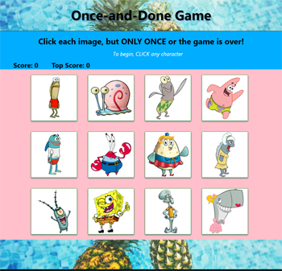

# Once-and-Done Game

### a memory game built with React.js

Run Application: [Once-and-Done](https://herokuapp.com/)

**Features**
* Click on any character ONCE to score points
* Points are added, High Score is displayed
* Character images shuffle position when clicked
* Game ends when user clicks any image more than once

**Technologies Used**
* React.js (create-react-app)
* JavaScript
* JSX syntax
* ES6
* CSS3
* Animation (shake) on hover


**Problems to Solve**
* Split code into manageable UI components
* Manage component state
* Respond to user events
* Render images
* Make application available to others

**Solutions**
* Used create-react-app to generate application
* Created small, re-usable "components"
* Used state/setState to initialize/update content
* Defined/passed properties "props"
* Used JSX syntax that combines markup and code
* Rendered images both local and public
* Deployed project using gitHub pages

**Setup to run application on your system**
* React.js must be installed on your system
* From a command line, navigate to directory in which you want the game created
* clone the repo into that directory
* While in that directory key:
```
 yarn start
```
* The browser should  open "http://localhost:3000", you should see the Once-and-Done Game



**To play Once-and Done**
* Click any image to earn a point.
* Goal is to reach a high score of 12 - one click for each image.
* If you click any image more than once, the game is over.
* The score resets to 0, but high score remains unless the page is refreshed.
* To play another game, simply click any image again.

**Resource Contributors**
* Background Photo: [Pineapple in water](https://www.pexels.com/photo/bright-bubble-color-flatlay-137132/)


**Future Enhancement Ideas**
* Add shimmer/water animation to background photo
* Add Save feature -save High Score even after page refresh

